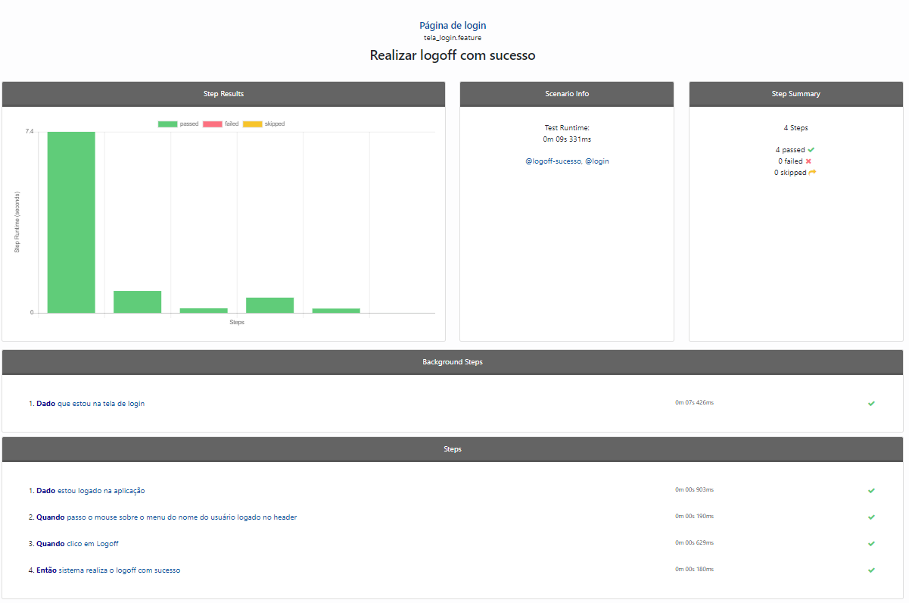
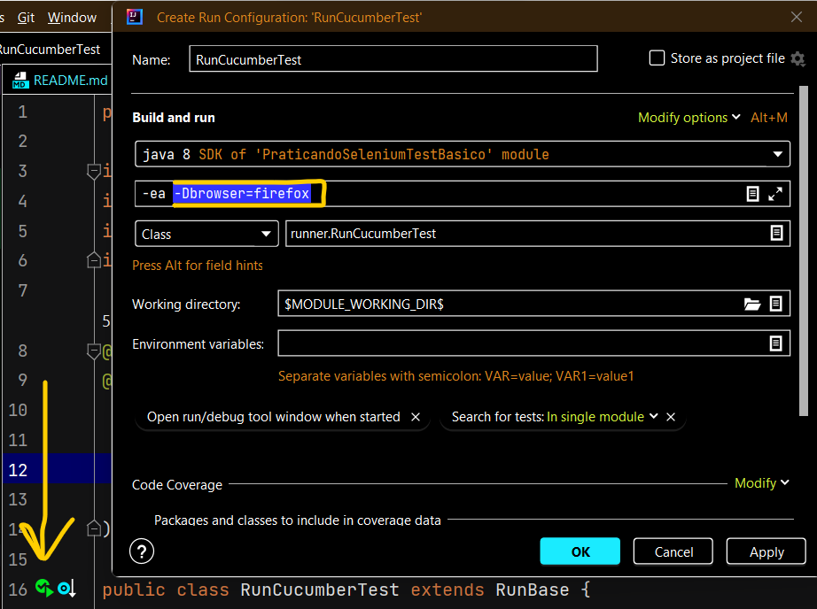
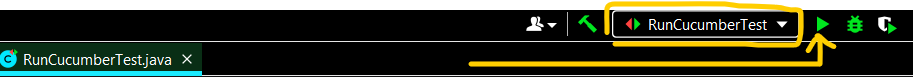
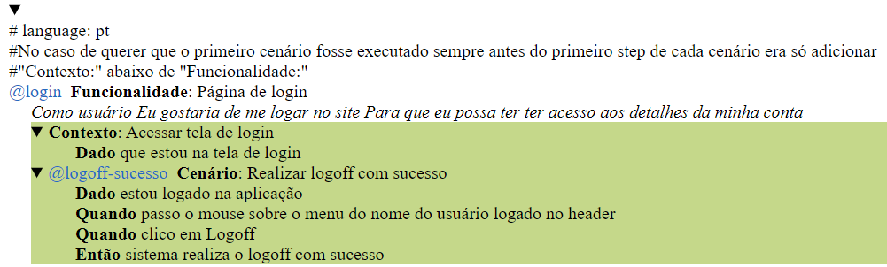
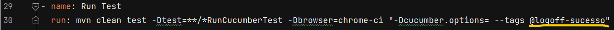
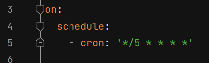
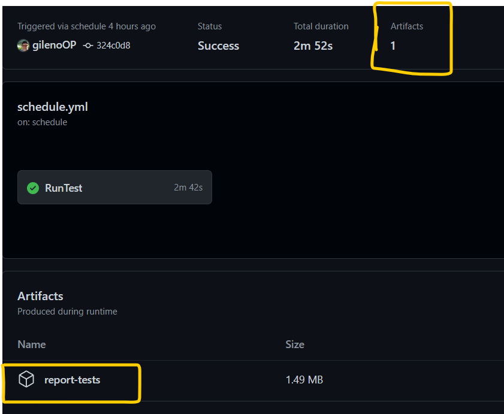
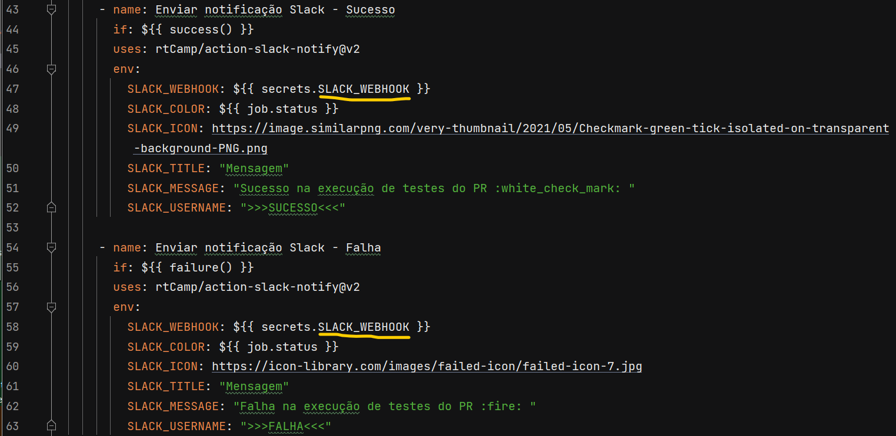

# Descrição

Mini projeto contendo testes automatizados de um site de e-commerce feito para testes e sem conexão com banco de dados nas páginas de Login e Cadastro de usuários em ambiente local e ambiente remoto através do GitHub Actions com envio de relatório, após a execução da build, print do erro, caso ocorra alguma falha de execução de algum step e envio de notificação de sucesso ou falha da build para o aplicativo de mensagens Slack, caso o usuário execute os testes via GitHub Actions.

Tanto o ambiente local quanto o remoto foram configurados para possibilitar o usuário a rodar os testes nos browsers Firefox e Chrome, deixando à escolha do usuário se vai executar os testes com ou sem interface gráfica (headless).

Caso a esolha seja com interface gráfica, o usuário terá condições de acompanhar visualmente a execução de cada step no browser escolhido até o fim da execução da build, caso a esolha seja sem interface gráfica (headless), o browser não vai ser exibido na tela, apesar do browser conseguir executar qualquer ação sobre a URL desejada no backgroud.

## Premissas para uso local

- É necessário validar se chromedriver e/ou geckodriver possui(em) a versão correta com relação ao browser a ser utilizado;

- Carregue as versões das dependências e plugins do pom.xml na IDE

## Tipos de testes

- Smoke tests - PR (local e remoto), possibilitando ao usuário que informe se o teste vai ser aplicado em todos cenários, em funcionalidades específicas ou cenários específicios.

- Schedule tests (remoto), possibilitando ao usuário que informe quando e qual a frequência que o workflow do GitHub deve iniciar os testes

## Rodar projeto em ambiente local

- Os testes locais estão configurados para rodarem das seguintes formas:
Via linha de comando no terminal da IDE passando como parâmetro o browser a ser utilizado.

Ex.:

mvn clean test -Dtest=**/*RunCucumberTest -Dbrowser=chrome  cluecumber-report:reporting
  
Obs.:

Após a execução da linha de comando acima que vai testar os cenários descritos na "tags = {""};" da classe RunCucumberTest, será gerado no caminho target/formatedreport/index.html do projeto e caso tenha tenha alguma falha nos testes, o print da tela do erro vai constar anexado no relatório.

- Acessando a classe o RunCucumberTest, modificando o Run e passando o parâmetro do browser "-Dbrowser=<nomedobrowser>" para informar o browser que será utilizado nos testes:

Após salvar a configuração, basta clicar em Run do item selecionado:

Obs.:

Quando a execução dos testes NÃO é feita pela linha de comando, o relatório é mais simples e é gerado no caminho target/reports/index.html

## Rodar Smoke Test do projeto em ambiente remoto

- Toda vez que o GitHub reconhecer um novo push local para o repositório e o usuário clicar no botão Compare & Pull Request do GitHub, o workflow da aba Actions vai iniciar a execução do arquivo tests.yml que é referente ao Smoke Test - PR (termo utilizado para testar coisas específicas, como a correção de um cenário, etc e assim evitar o teste de todos os cenários do projeto). Para informar qual(is) cenário(s) o workflow deve testar, basta anotar as tags desejadas dos cenários/funcionalidades  existentes do arquivo .feature do projeto e informar no arquivo tests.yml.

Ex.:

## Rodar Schedule Test do projeto em ambiente remoto

- Toda vez que o GitHub reconhecer um novo push local para o repositório e o usuário clicar no botão Compare & Pull Request do GitHub, o workflow da aba Actions vai acessar o arquivo schedule.yml e verificar em que momento e com que frequência que o usuário configurou o teste para ser executado. Se não for de imediato, o sistema deixa o teste em StandBy até que o momento parametrizado chegue.

Obs.: Caso o usuário esteja usando o GitHub de forma free, talvez o horário de execução não seja milimetricamente cumprido, podendo atrasar um pouco.

## Como agendar os testes
Para parametrizar o momento e frequência de execução dos testes, basta acessar o arquivo schedule.yml e informar os valores cron.
Ex.:

Na imagem acima, o agendamento parametrizado é a partir do momento que o workflow acessar esse arquivo, executá-lo e de 5 em 5 minutos o teste seja executado novamente em todas as horas, dias, meses e anos.
Para acessar o relatório/print de erro basta clicar no RunTest que acabou de ser executado e baixar o arquivo.

Para melhor entendimento do que cada asterisco representa no cron, sugiro acessar o link abaixo e informar valores para simular o agendamento:
https://crontab.guru/

## Configurando a notificação para o aplicativo Slack
Para que a notificação do status dos testes seja enviado para o aplicativo Slack é necessário realizar os seguintes passos:
### Aplicativo Slack
- Instalar o aplicativo Slack no celular
- Criar um canal no aplicativo Slack ou criar no passo mais à frente para que receba as mensagens
### Criando o WebHooks de entrada
É necessário criar o WebHooks de entrada para que seja possível a comunicação do workflow com o canal criado no aplicativo Slack. Pa ra isso basta:
- Acessar o link https://home-hug4536.slack.com/apps/A0F7XDUAZ-webhooks-de-entrada?tab=more_info
- Clicar no botão Adicionar ao Slack
- Navegar até a seção Postar no Canal e informar o canal (se já tiver criado) ou clicar no link Crie um novo canal
- Clicar no botão Adicionar intergração com o WenHooks de entrada, gerando uma linha de código
### Configurando o WebHook de entrada gerado no workflow do Github
- Acessar repositório > aba Settings
- Acessar menu lateral esquerdo Secrets and variables > Actions
- Clicar no botão New repository secret
- Colocar no campo Nome um nome para a variável que vai guardar o segredo de acesso
- Informar no campo Secret o código gerado do WebHook de entrada

### Configurando o arquivo .yml que deseja colocar a função de envio de notificação para o aplicativo Slack
- Editar o arquivo .yml de testes substituindo o nome da variável pelo nome da variável que você escolheu, tanto no bloco de notificação para sucesso, quanto no bloco de falha

### Personalizando as mensagens de notificação
Como o workflow utilizado para realizar o envio de mensagens para o aplicativo Slack é o Slack Notify - GitHub Action, o criador disponibilizou um link onde explica a funcionalidade do workflow e lá constam informações que podem ajudar a personalizar a mensagem que será enviada para o aplicativo Slack:
https://github.com/marketplace/actions/slack-notify

# Instalação no servidor
## Pré requisitos
## Configurações do pool
## appsettings.json (Instalação em ambiente do cliente. Usar como referência o arquivo appsettings.ApiClient.json)
## appsettings.json (Instalação em ambiente da nuvem. Usar como referência o arquivo appsettings.ApiRgb.json)
## Web.config
## Configurações para o deploy no Visual Studio
## Configuração do Chosen
# Versionamento
# Testes
# Imagens
### Versão instalada na nuvem vai aparecer com o header na cor cinza
### Versão instalada na nuvem vai aparecer com o header na cor preta
### Versão da dll é igual a versão apresentada na tela
### Versionamento da Api

